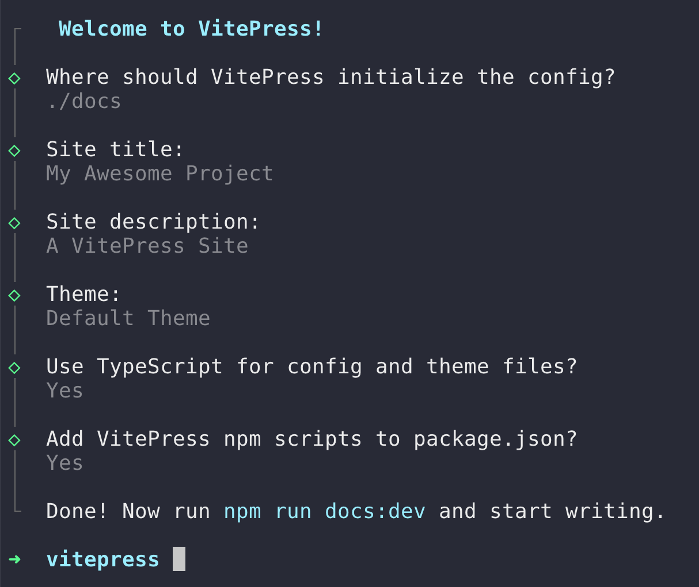
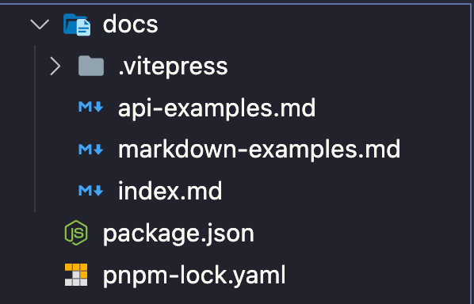
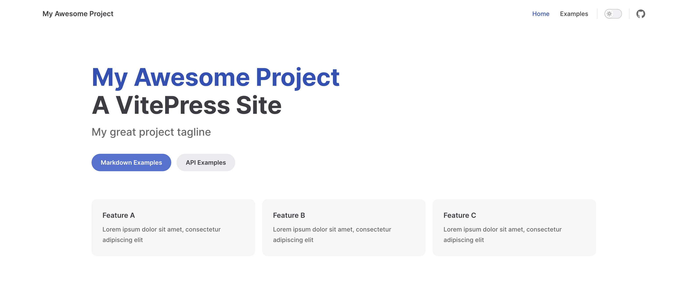
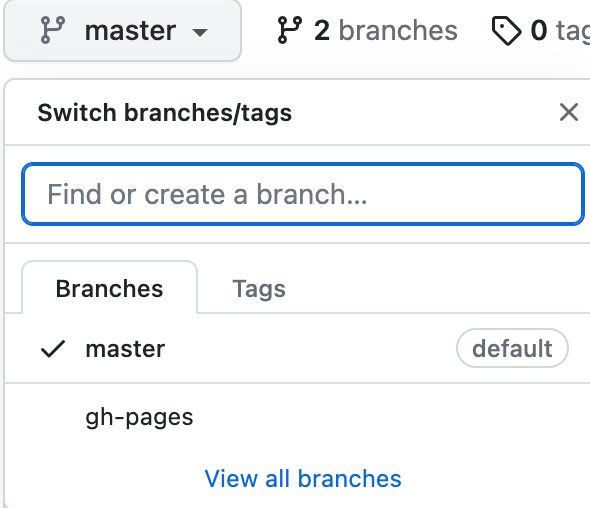
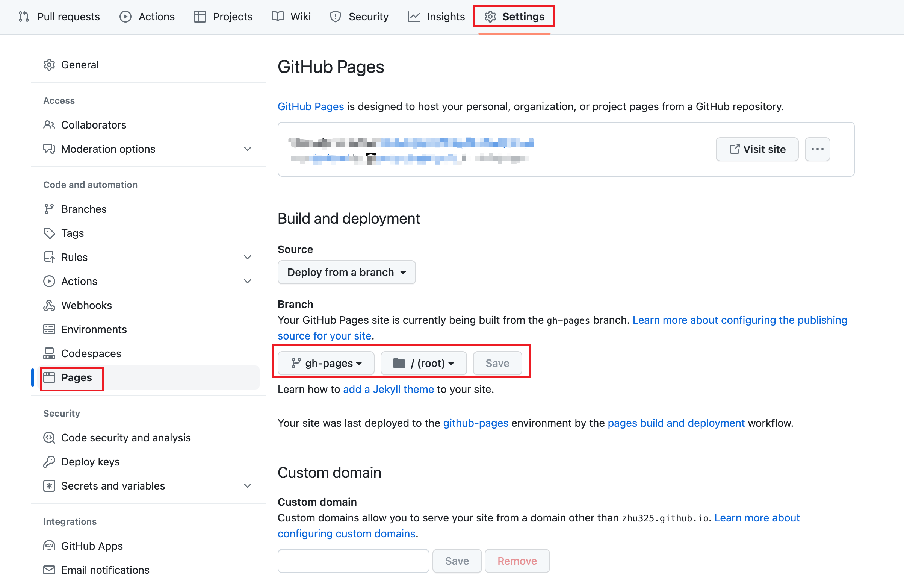
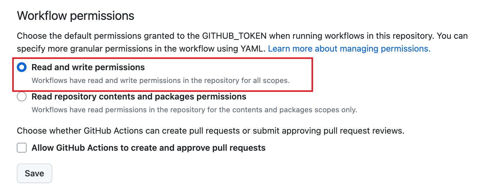
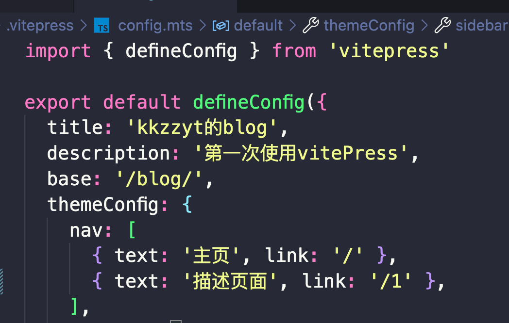

## 前言
----------
 `博客的搭建过程，记录一下，以便以后查阅。`

## 什么是vitepress
 <!-- 技术选型: `vitepress`  -->

 关于`vitepress`的介绍，可以参考官网: [https://vitepress.dev/](https://vitepress.dev/)

## vitepress的安装

⚡️ 根据文档，我们可以通过`npm` `yarn`或者`pnpm`来安装`vitepress`，这里我选择`pnpm`，
因为在使用`vite`的时候，`pnpm`的速度比`npm`和`yarn`都要快。

```bash
pnpm add -D vitepress
npx vitepress init
```
当命令执行完成后，将会出现一些简单的问题，完成选择后将自动创建项目



⚡️  创建完项目后，会发现vitepress的目录结构非常干净，只有一个`docs`目录，里面有一些`markdown`文件和一个`.vitepress`目录，`.vitepress`目录里面有一个`config.mts`文件，这个文件是`vitepress`的配置文件，我们可以在这里配置一些全局的配置，比如`title`、`description`、`head`、`themeConfig`等等。



使用命令 `pnpm docs:dev` 可以运行项目，如下图。



## 上传代码到GitHub

```bash
git add .
git commit -m 'blog'
git push
```

## 部署项目自动化

⚡️ 新建文件`deploy.yml`存放到`.github/workflows/`目录下

复制代码到文件`deploy.yml`，上传到GitHub中
```yml
name: Deploy

on:
  push:
    branches:
      - main

jobs:
  deploy:
    runs-on: ubuntu-latest
    steps:
      - uses: actions/checkout@v2
      - uses: actions/setup-node@v3
        with:
          node-version: 16
      - run: npm i pnpm -g
      - run: pnpm install --frozen-lockfile

      - name: Build
        run: pnpm docs:build

      - name: Deploy
        uses: peaceiris/actions-gh-pages@v3
        with:
          github_token: ${{ secrets.GITHUB_TOKEN }}
          publish_dir: docs/.vitepress/dist

```
Github会自己执行Actions,完成之后会在分支中，新增一个分支`gh-pages`,



在`settings`中`pages` 配置源为分支 `gh-pages`



✅ 自动部署已完成，以后只需将代码上传到仓库，网站将自动进行更新打包

## 遇到的问题
> ### Action自动脚本执行失败

**GitHub Action: The process ‘/usr/bin/git‘ failed with exit code 128**

⚡️ 解决方法

在 `settings` `Actions` 下的 `General` 中找到下面选项



> ### 部署后打开网址静态资源404

⚡️ 解决方法  [原文链接🔗]([link](https://vitepress.dev/guide/deploy#setting-a-public-base-path))


修改`config.mts` 中的`base`属性，值为git仓库名称 `/blog/`



 
<style>
  img{
    width:80%;
  }
</style>